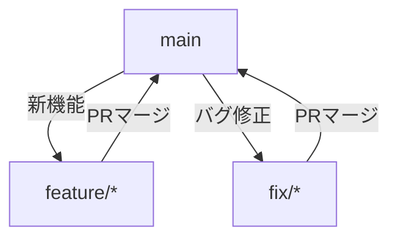

# GitHub開発手順書

XboostプロジェクトのGitワークフローとGitHub活用ガイドです。

## 目次

1. [Git基本操作](#git基本操作)
2. [コミットメッセージ規約](#コミットメッセージ規約)
3. [ブランチ戦略](#ブランチ戦略)
4. [プルリクエスト](#プルリクエスト)
5. [開発環境設定](#開発環境設定)
6. [GitHub Actions](#github-actions)
7. [よくある問題と解決策](#よくある問題と解決策)

---

## Git基本操作

### ブランチの作成

```bash
# mainブランチから新しい機能ブランチを作成
git checkout main
git pull origin main
git checkout -b feature/107-github-workflow
```

### コミット

```bash
# 変更をステージング
git add .

# コミットメッセージ付きでコミット
git commit -m "feat: GitHub開発手順書を追加"
```

### プッシュ

```bash
# リモートブランチにプッシュ
git push -u origin feature/107-github-workflow
```

### プルリクエストの作成

```bash
# GitHub CLIを使用（推奨）
gh pr create --title "[DOCS] GitHub開発手順書" --body "変更内容の説明" --base main
```

またはブラウザから:
1. GitHubリポジトリを開く
2. 「Pull requests」タブをクリック
3. 「New pull request」をクリック
4. ブランチを選択し、PRを作成

---

## コミットメッセージ規約

### フォーマット

```
<type>: <subject>

<body>

<footer>
```

### Type

| Type | 説明 | 例 |
|------|------|-----|
| `feat` | 新機能 | `feat: Stripe決済機能を追加` |
| `fix` | バグ修正 | `fix: ログインエラーを修正` |
| `docs` | ドキュメント更新 | `docs: READMEを更新` |
| `style` | コードスタイル（機能変更なし） | `style: インデントを修正` |
| `refactor` | リファクタリング | `refactor: ユーザー認証ロジックを改善` |
| `test` | テスト追加・修正 | `test: サブスクリプションAPIのテストを追加` |
| `chore` | ビルドプロセス・ツール変更 | `chore: ESLint設定を更新` |

### 例

```
feat: Stripe決済機能を追加

Checkout Session、Customer Portal、Webhookハンドラを実装。
14日間のトライアルを追加。

Refs: #11
```

---

## ブランチ戦略

### メインブランチ

- `main`: 本番用。常にデプロイ可能な状態を維持
- `develop`: 開発用（必要に応じて使用）

### フィーチャーブランチ

| パターン | 用途 | 例 |
|----------|------|-----|
| `feature/issue番号-機能名` | 機能追加 | `feature/96-post-editor` |
| `fix/issue番号-バグ概要` | バグ修正 | `fix/101-login-error` |
| `docs/issue番号-ドキュメント名` | ドキュメント | `docs/107-github-flow` |
| `refactor/issue番号-概要` | リファクタリング | `refactor/105-auth-cleanup` |

### ブランチフロー



1. `main`から機能ブランチを作成
2. 機能開発とコミット
3. プッシュしてPRを作成
4. レビュー後に`main`にマージ

---

## プルリクエスト

### PR作成のチェックリスト

- [ ] コードがlintエラーなし (`npm run lint`)
- [ ] typecheckが通る (`npm run typecheck`)
- [ ] ビルドが成功する (`npm run build`)
- [ ] PRの説明が適切に記述されている
- [ ] 関連Issueを参照している (`Close #107`)

### PRテンプレート

```markdown
## 変更内容
- 変更点1: 説明
- 変更点2: 説明

## 関連Issue
Close #107

## テスト方法
1. 手順1
2. 手順2

## スクリーンショット
（必要な場合）
```

### レビューフロー

1. **作成**: 開発者がPRを作成
2. **レビュー**: PMまたは他の開発者がレビュー
3. **修正**: 指摘事項を修正
4. **承認**: レビュー完了
5. **マージ**: `Squash and merge`でマージ

---

## 開発環境設定

### GitHub CLIのインストール

#### Windows

```bash
# wingetを使用
winget install --id GitHub.cli
```

#### macOS

```bash
# Homebrewを使用
brew install gh
```

#### Linux

```bash
# Ubuntu/Debian
curl -fsSL https://cli.github.com/packages/githubcli-archive-keyring.gpg | sudo dd of=/usr/share/keyrings/githubcli-archive-keyring.gpg
echo "deb [arch=$(dpkg --print-architecture) signed-by=/usr/share/keyrings/githubcli-archive-keyring.gpg] https://cli.github.com/packages stable main" | sudo tee /etc/apt/sources.list.d/github-cli.list > /dev/null
sudo apt update
sudo apt install gh
```

### 認証

```bash
# GitHubにログイン
gh auth login

# 設定:
# - GitHub.com
# - HTTPS
# - Login with a web browser
```

### Gitユーザー設定

```bash
# グローバル設定
git config --global user.name "Takahiro Motoyama"
git config --global user.email "t.ndc16@gmail.com"

# またはリポジトリごとの設定
git config user.name "Takahiro Motoyama"
git config user.email "t.ndc16@gmail.com"
```

### GPG署名の設定（オプション）

```bash
# GPGキー作成
gpg --full-generate-key

# 作成したキーを確認
gpg --list-secret-keys --keyid-format=long

# Gitで使用
git config --global gpg.program gpg
git config --global commit.gpgsign true
git config --global user.signingkey YOUR_KEY_ID

# GitHubに公開鍵を登録
gpg --armor --export YOUR_KEY_ID
```

### プロジェクトのクローン

```bash
# HTTPSでクローン
git clone https://github.com/tndg16-bot/xboost.git
cd xboost

# またはSSHを使用
git clone git@github.com:tndg16-bot/xboost.git
cd xboost
```

---

## GitHub Actions

### CI/CDパイプライン

自動化されたタスク（現在は未実装、今後追加予定）:
- ✅ Lintチェック (`npm run lint`)
- ✅ TypeScript typecheck (`npm run typecheck`)
- ✅ ビルド検証 (`npm run build`)
- 🔄 テスト実行（実装中）
- 🔄 自動デプロイ（検討中）

### ワークフローの場所

`.github/workflows/` にymlファイルを配置

### ワークフローの追加方法

1. `.github/workflows/`ディレクトリを作成
2. ymlファイルを作成（例: `ci.yml`）
3. プッシュで自動実行

例:

```yaml
name: CI

on:
  push:
    branches: [main, develop]
  pull_request:
    branches: [main]

jobs:
  build:
    runs-on: ubuntu-latest

    steps:
    - uses: actions/checkout@v3

    - name: Setup Node.js
      uses: actions/setup-node@v3
      with:
        node-version: '20'

    - name: Install dependencies
      run: npm ci

    - name: Lint
      run: npm run lint

    - name: Typecheck
      run: npm run typecheck

    - name: Build
      run: npm run build
```

---

## よくある問題と解決策

### マージコンフリクト

```bash
# 最新のmainをマージ
git fetch origin
git merge origin/main

# コンフリクトを解決後
git add .
git commit -m "fix: マージコンフリクトを解決"
```

### フォースプッシュ（避けるべき）

```bash
# ✗ ダメ（履歴を破壊する可能性）
git push -f

# ✓ 安全な方法
git push --force-with-lease
```

### 間違ったコミットを修正

```bash
# 最新のコミットを修正
git commit --amend

# 最新のコミットメッセージのみ修正
git commit --amend -m "正しいコミットメッセージ"

# プッシュ済みのコミットを修正（注意）
git push --force-with-lease
```

### 過去のコミットを修正

```bash
# 最新3コミットを編集
git rebase -i HEAD~3

# エディタで:
#   - 修正したいコミットを `pick` → `edit` に変更
#   - 保存して終了

# コミットを修正
git add .
git commit --amend

# Rebaseを続行
git rebase --continue

# プッシュ（注意）
git push --force-with-lease
```

### 変更を取り消す

```bash
# 作業ディレクトリの変更を取り消す
git checkout -- <file>

# ステージングの変更を取り消す
git reset HEAD <file>

# 最新のコミットを取り消す（変更を保持）
git reset --soft HEAD~1

# 最新のコミットを完全に取り消す
git reset --hard HEAD~1
```

### ブランチ名を変更

```bash
# ローカルブランチ名を変更
git branch -m old-branch-name new-branch-name

# リモートブランチも更新
git push origin :old-branch-name
git push origin new-branch-name
```

### 誤ってmainブランチに変更してしまった

```bash
# mainブランチをリモートの状態にリセット
git fetch origin
git reset --hard origin/main
```

### リモートブランチが削除されたのにローカルに残っている

```bash
# リモートブランチ情報を更新
git fetch --prune
```

---

## 開発ワークフローの例

### 新機能開発

```bash
# 1. Issueを作成 (#107)

# 2. ブランチ作成
git checkout main
git pull origin main
git checkout -b feature/107-github-workflow

# 3. 開発とコミット
git add .
git commit -m "feat: ドキュメントの構造を作成"

# 4. プッシュとPR作成
git push -u origin feature/107-github-workflow
gh pr create --title "[DOCS] GitHub開発手順書" --body "変更内容" --base main
```

### バグ修正

```bash
# 1. ブランチ作成
git checkout main
git pull origin main
git checkout -b fix/123-login-error

# 2. 修正とコミット
git add .
git commit -m "fix: ログイン時のトークンエラーを修正 (#123)"

# 3. プッシュとPR作成
git push -u origin fix/123-login-error
gh pr create --title "[FIX] ログインエラー" --body "Fix #123" --base main
```

---

## 参考リソース

- [GitHub公式ドキュメント](https://docs.github.com/ja)
- [Pro Git書籍](https://git-scm.com/book/ja/v2)
- [Conventional Commits](https://www.conventionalcommits.org/)
- [GitHub CLIドキュメント](https://cli.github.com/manual/)

---

**Happy Coding! 🚀**
